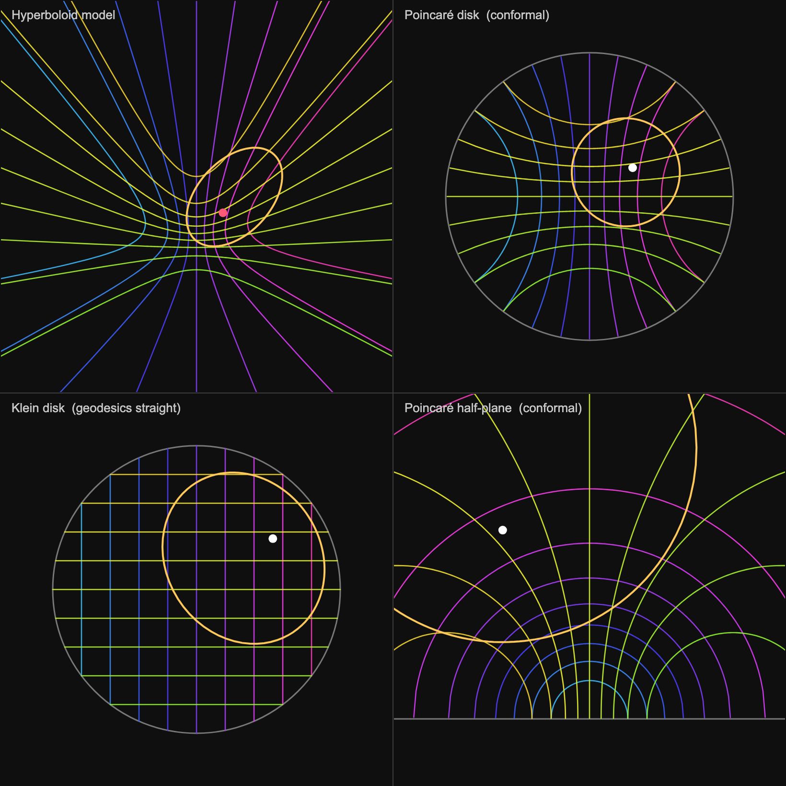

# Four Models of the Hyperbolic Plane

An interactive p5.js visualization showing the **same point and the same
geometry** rendered simultaneously in the four standard models of the
hyperbolic plane **H²**:

```
┌────────────────────┬─────────────────────┐
│  Hyperboloid (3D)  │  Poincaré disk      │
├────────────────────┼─────────────────────┤
│  Klein disk        │  Poincaré half-plane│
└────────────────────┴─────────────────────┘
```

Move your cursor over **any** panel and one hyperbolic point (the red dot)
traces across all four models at once. A grid of geodesics and a hyperbolic
circle around the point are drawn in every panel so you can watch how each
model distorts the *same* objects differently.



## Running it

It needs to be served over HTTP (opening `index.html` as a `file://` URL can
fail due to caching and is harder to refresh):

```sh
cd hyperbolic-plane
python3 -m http.server 8077
# then open http://localhost:8077/index.html
```

## What you're looking at

| Element | Meaning |
|---|---|
| **Red dot** | The single hyperbolic point you control with the cursor (canonical state `P`). |
| **Yellow circle** | A *hyperbolic* circle — every point on it is the same hyperbolic distance (`CIRCLE_RADIUS = 0.9`) from the red dot. |
| **Colored grid** | A "Cartesian" grid of geodesics. Color is keyed by index, so a given geodesic is the **same color in all four panels**. |

The point of the side-by-side layout: it's all **one** 2D geometry. Each model
is a different (necessarily distorting) map of it.

- **Hyperboloid** — H² as the surface `x² + y² − z² = −1` in Minkowski space;
  the "honest" view. The bowl shape is an artifact of the ambient space, not
  the intrinsic curvature.
- **Poincaré disk** — conformal (preserves angles); geodesics are arcs meeting
  the boundary at right angles. The yellow circle stays a true circle.
- **Klein disk** — geodesics are straight chords, but angles and shapes
  distort (the yellow circle becomes an ellipse).
- **Poincaré half-plane** — also conformal; geodesics are semicircles
  perpendicular to the real axis.

Watch a geodesic toward the disk edge: it bows away from center and approaches
(but never touches) the boundary, because the boundary represents points
infinitely far away.

## Interaction

- **Cursor in any panel** sets the point; it updates everywhere live.
- The **hyperboloid panel** is interactive too: the 2D cursor is
  inverse-projected onto the 3D surface (`inverseHyper`), picking the surface
  nearest the camera.

## How it works

Everything is driven by one canonical state: a point `P = [x, y, z]` on the
upper sheet of the hyperboloid. Each panel is just a different projection of
`P` (and of the grid / circle points):

- **Poincaré disk** — stereographic projection from `(0, 0, −1)`.
- **Klein disk** — central projection from the origin.
- **Half-plane** — Cayley transform of the disk.
- **Hyperboloid** — tilted orthographic view of the surface.

The hyperbolic circle is built honestly in Minkowski space as
`cosh(ρ)·P + sinh(ρ)·(cos θ·e₁ + sin θ·e₂)`, where `e₁, e₂` are
Minkowski-orthonormal tangent vectors at `P` — the hyperbolic analog of
`center + r·(cos θ, sin θ)`. The geodesic grid is authored as straight chords
in Klein coordinates (where chords *are* geodesics) and converted to canonical
coordinates, so the same lines render straight in Klein and as
boundary-orthogonal arcs in the conformal models.

## Notes & limitations

- This is **H²** (2-dimensional hyperbolic geometry), not H³. The boundary is a
  circle, not a sphere.
- Geodesic arcs are drawn as sampled polylines (160 points each), not analytic
  arcs — smooth at this density.
- Grid geodesics stop just shy of the boundary by design; their true endpoints
  are infinitely far away.
